#  S/4 HANA Product Masterdata RAG application

This sample CAP application uses the CAP LLM Plugin to simplify the process of accessing HANA Vector/Embedding features, connectivity to AI Core and automate the entire RAG retrieval flow. It demonstrates a RAG scenario where users can ask any questions regarding products data from S/4HANA and the application displays the relevant products based on the user query and the description generated by the LLM.

## Pre-requisite:

-   Login to [SAP BTP Trial cockpit](https://account.hanatrial.ondemand.com/trial/#/home/trial).
-   Navigate to your subaccount and make sure all roles are assigned for your user as shown below:
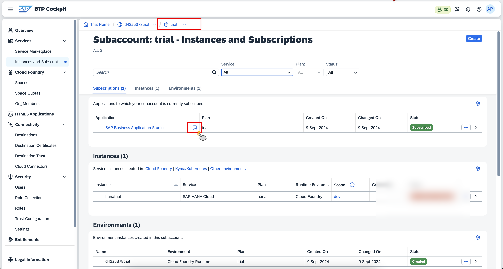

### Follow the Hands-on Pre-requisites here: [Hands-On Prerequisites](docs/readme.md)

## Clone Repo

-   Navigate to Instances and Subscriptions and Open Business Application Studio
    

-   If dev space is already created, you can start the dev space as shown below. If not proceed to next step. 
    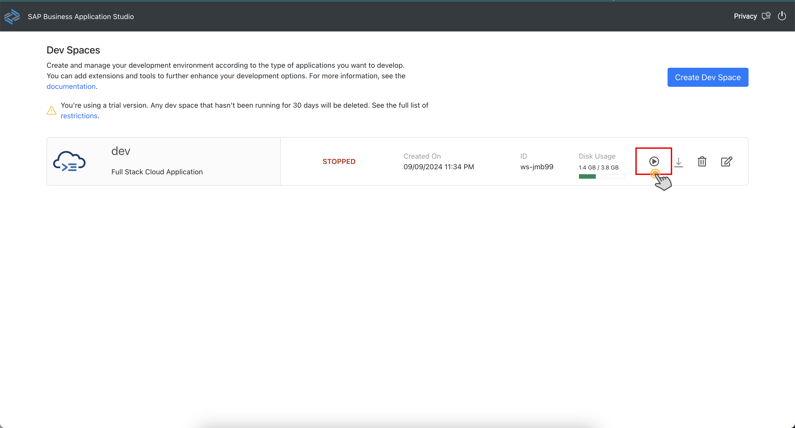

-   Create dev space by following below steps:
    
    
    (Make Sure to Choose Python Tools)

-   Once dev space running click on the dev space name to open it.
    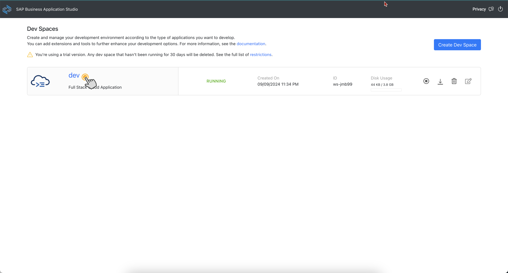

-   Click on Git Clone Repo 
    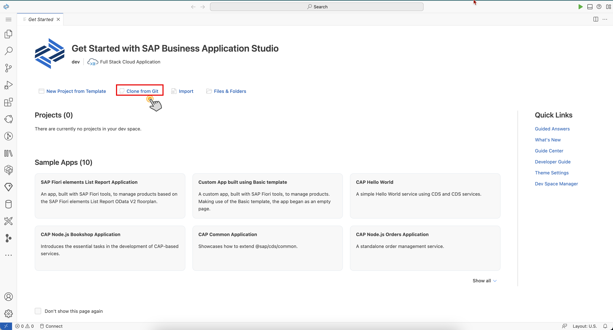
    and Provide followin url:
    `https://github.com/navyakhurana/cpa-genai-usecase.git`    
    
    Click open when you see following pop-up.
    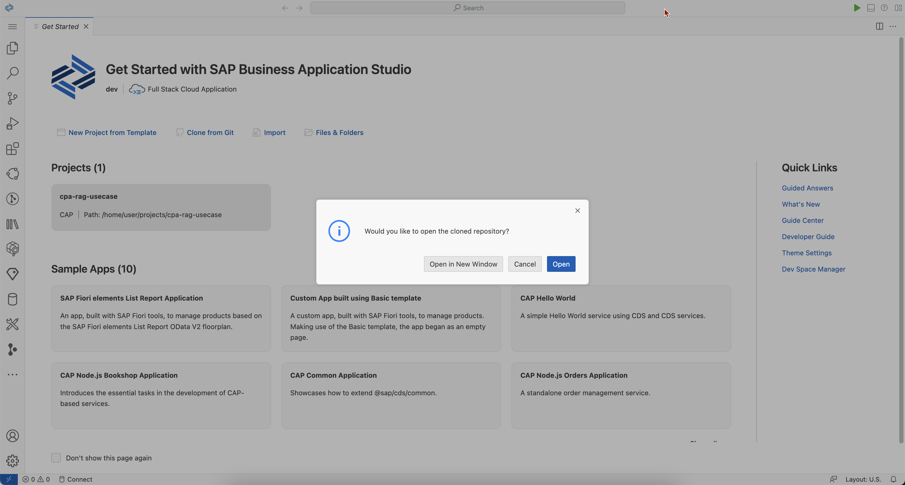
    
-   Replace the content of  ".cdsrc.json" with the content of attachment shared over email.
    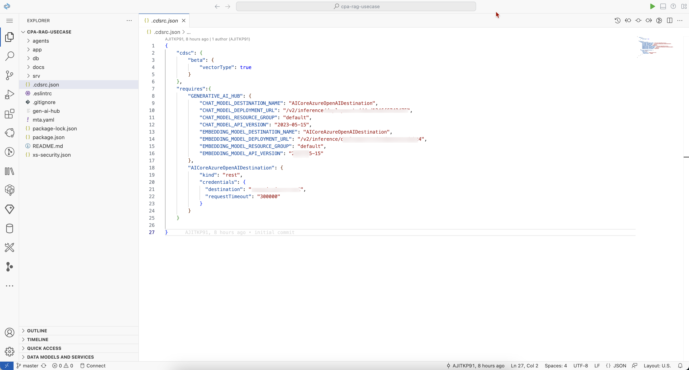

## Import Destination
-   Go to BTP cockpit and trial subaccount. Then navigate to Destination under connectivity menu item. Click on import destination.
    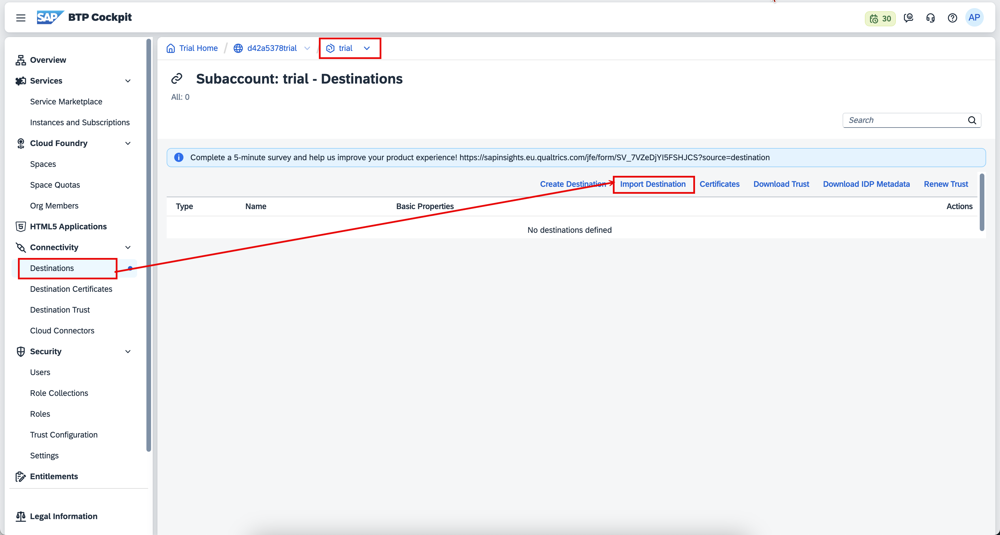
-   Select the 'gen-ai-hub' file shared in the email
    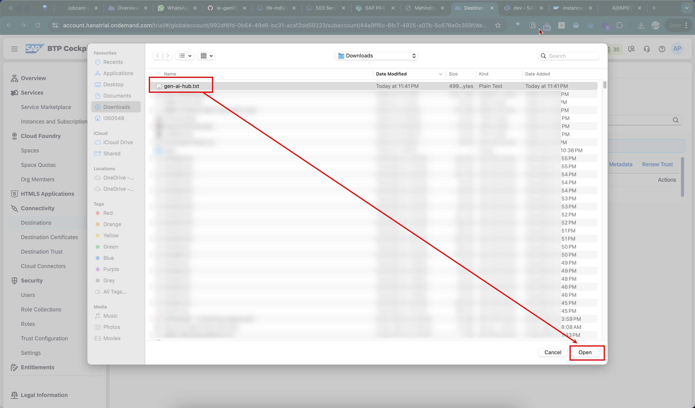
-   Save the destination
    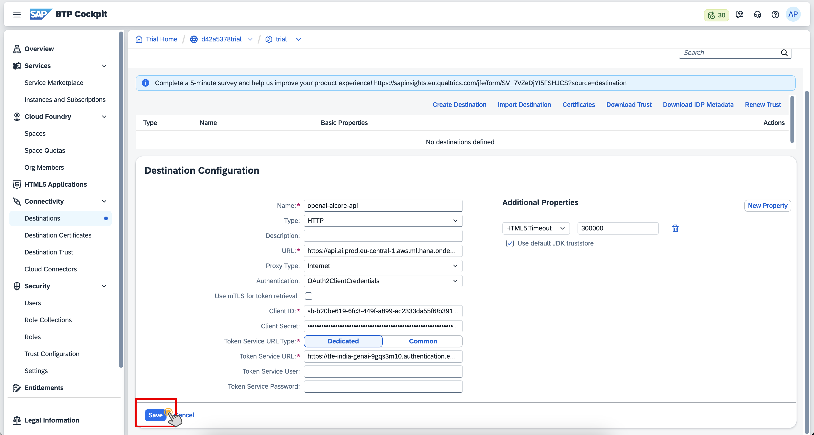


## Deploy on SAP BTP:
-   Go to BTP Cockpit, Trial subaccount and Overview page. Then copy API Endpoint from Cloud Foundry Environment Section
    
-   Go to BAS and Open terminal by right clicking on mta.yaml file and choose open integrated terminal
    
-   use following command to login into cf:
    `cf login -a CF-API-Endpoint --sso`    
    
    replace CF-API-Endpoint with api end point copied in previous step
-   Click on the temporary authentication code url and it should open the url in next tab
    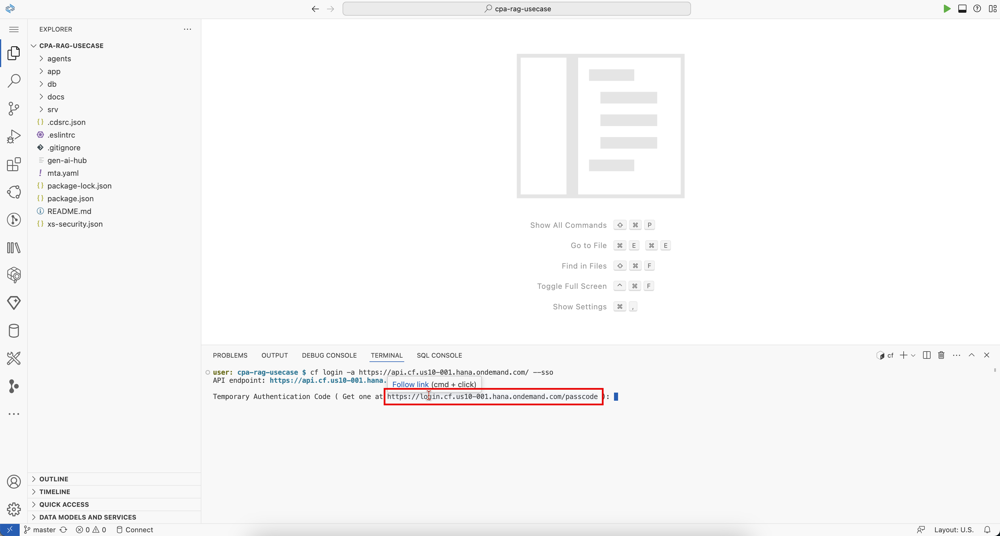
-   If asked, click on 'sign in with default identity provider' and it will generate the auth code.
    
-   Copy the authentication code and put it back in terminal to login.
    
-   Once logged in successfully, make sure targeted space is set as shown below.
    
-   Install dependencies by using following command:
    `npm install`
-   Build the project by using following command:    
    `npm run build`     
    Once built successfully, you should see following message
    
-   Depploy the project by using following command:
    `npm run deploy`    
    Once deployed successfully, you should see following messages. Copy the approuter url as shown below. Keep a note of approuter url.
    

## How to use the application:
-   Download the csv file and save it to local computer which contains material data from SAP S/4HANA. (Right click on s4-product-data.csv and choose download)
    
-   Open the approuter applciation URL (Saved in previous step from deployment)
-   Upload the "s4-products.csv" file by chosing upload files
    
    select the filw
    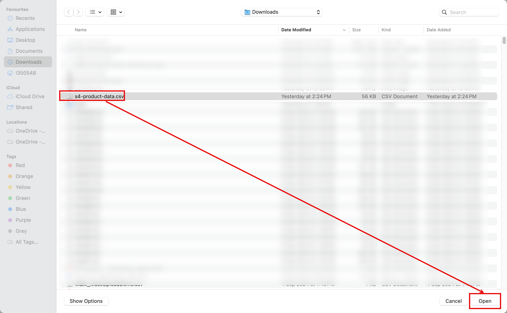
    once successfullly uploaded:
    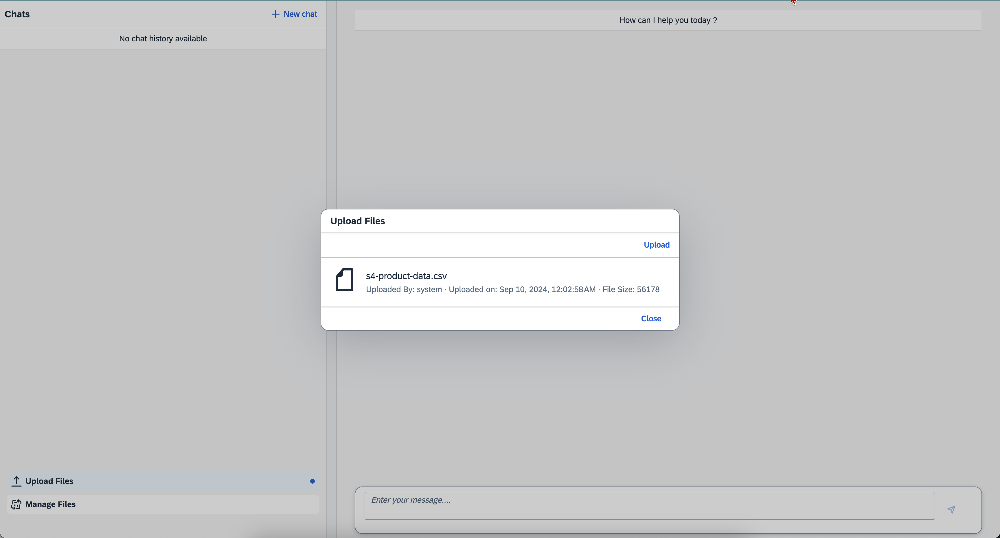
-   Create the embedding of csv file uploaded in previous step. Click on Manage Files and click on create embedding
    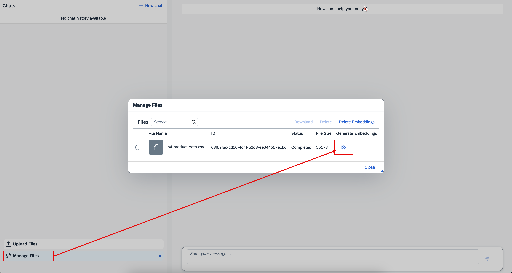

    **Note: It might take 1 to 2 minutes!**
-   Once embeddings created successfully, following message will appear:
    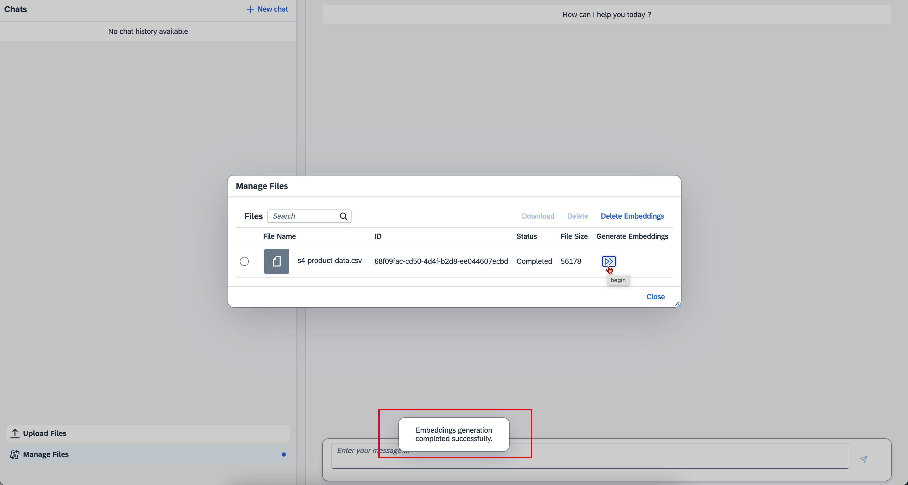

    Now you can use the chat input message. 

#### Sample Chat Inputs to Tryout!

1. Sample Chat 1: (Click on **+ New Chat** For a fresh window chat) and use following message inputs one by one:            
    ```
    nutritional food for cats
    ``` 
    ```
    What is the weight of MonPetit Crispy Kisses Variety Pack Comp item?
    ```
    ```
    dental care kit for cat?
    ```
    
 
2. Sample Chat 2: Click on **+ New Chat** For a fresh window chat and use following message inputs  one by one:    
    ```
    Items used for skin protection
    ```
    ```
    What are Vaseline HG 100g products?
    ```
    ```
    provide product ids of Vaseline Products?
    ```
    ```
    List down the product ids and description for moisturizing hand?
    ```
    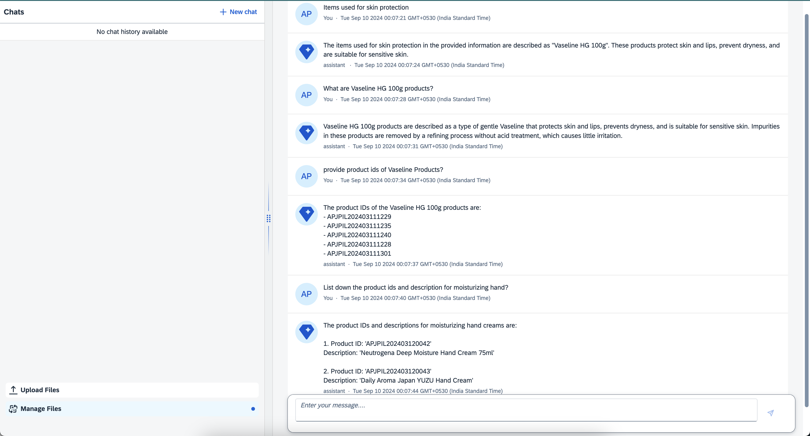


## Agents Hand-On. 
-   If you have completed this hands-on, you can proceed to try out agents from [here](./agents/README.md)
