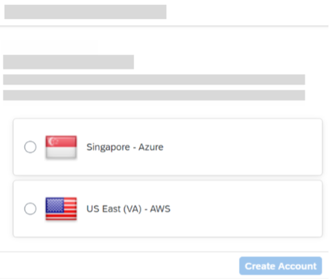
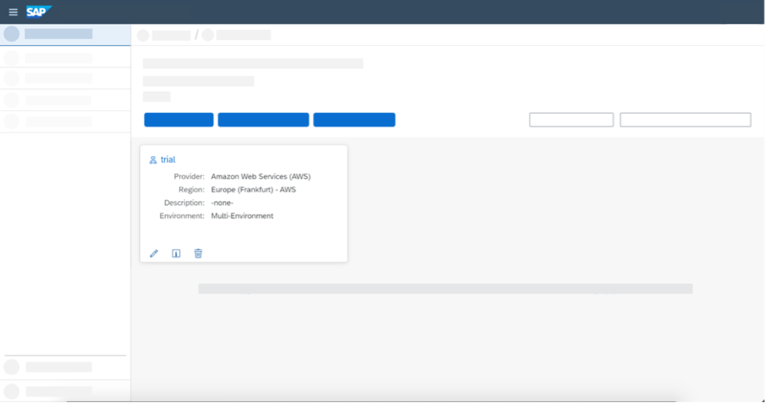
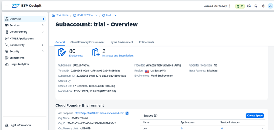
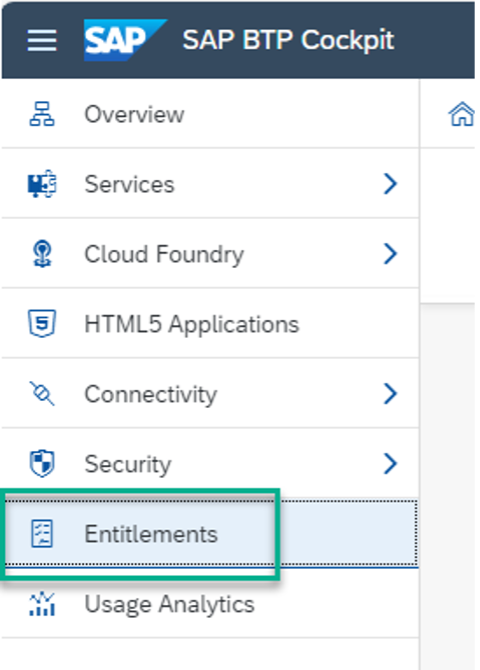
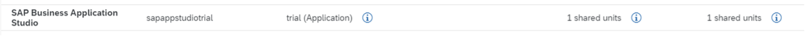
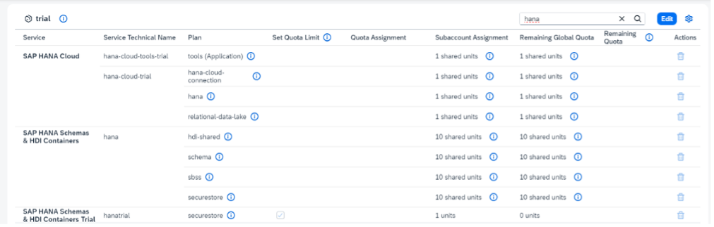
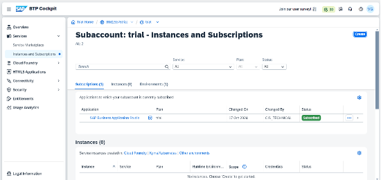

## Hands-on Pre-Requisites:
1.	Go to the SAP BTP Trial page and click Go to your Trial Account. 

2.	Create a subaccount that lives in a geographic region. Select the US East (VA) – AWS region and click Create Account to trigger the provisioning process.

3.	You will then see a dialog box while the account is set up. When complete, click Continue to close to popup and to navigate to the new account.

4.	The global trial account contains one subaccount and space. Navigate to subaccount by clicking on the tile named trial (this name may vary if you created the subaccount manually).

5.	This page will display the current state of the subaccount. 

  
 
6.	Go to Entitlements.

  

7.	Make sure the entitlements listed below are added. 
-	SAP Business Application Studio with plan trial(application)

  
 
-	SAP HANA Cloud with plan tools (Application)

  

8.	Go back to Trial Home.

9.	Check if the SAP Business Application Studio subscription is added in Services > Instances &  Subscriptions.

    

10.	Setup SAP HANA Cloud by following the below tutorials:
-	[HANA Cloud Mission Trial-2](https://developers.sap.com/tutorials/hana-cloud-mission-trial-2.html)
-	[HANA Cloud Mission Trial-3](https://developers.sap.com/tutorials/hana-cloud-mission-trial-3.html)

11.	Map Cloud Foundry org to SAP HANA Cloud instance:

  [HANA Cloud Mission Trial-2](https://developers.sap.com/tutorials/hana-cloud-mission-trial-8.html)
  > NOTE:
  > In the above tutorial, Step 1: Do till point 3 (both screenshots of point 3)
